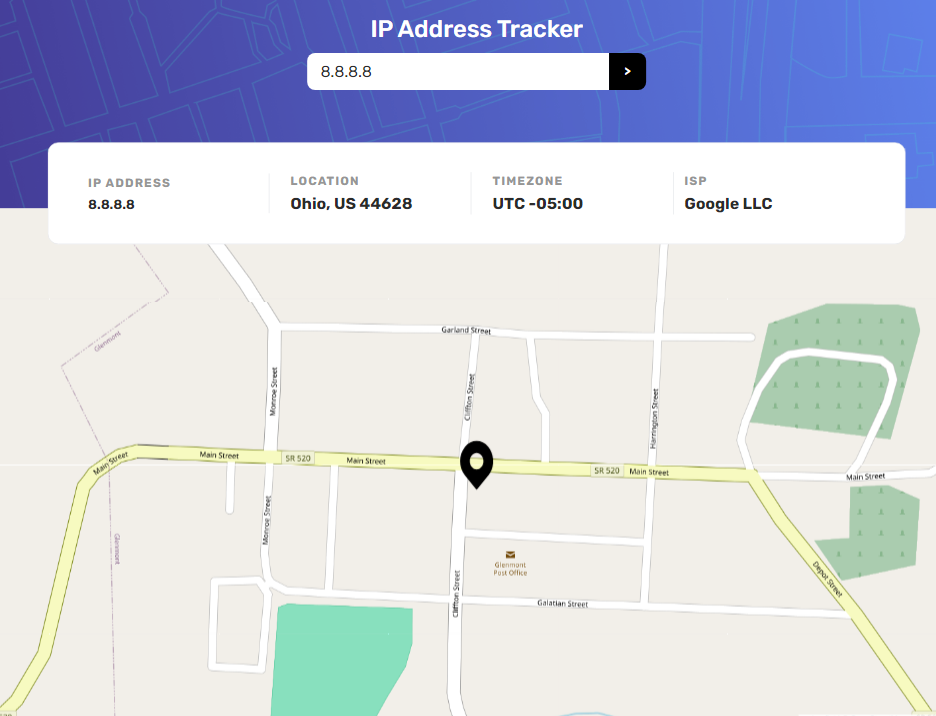

# Frontend Mentor - IP address tracker solution

This is a solution to the [IP address tracker challenge on Frontend Mentor](https://www.frontendmentor.io/challenges/ip-address-tracker-I8-0yYAH0). Frontend Mentor challenges help you improve your coding skills by building realistic projects. 

## Table of contents

- [Overview](#overview)
  - [The challenge](#the-challenge)
  - [Screenshot](#screenshot)
  - [Links](#links)
- [My process](#my-process)
  - [Built with](#built-with)
  - [What I learned](#what-i-learned)
  - [Continued development](#continued-development)
  - [Useful resources](#useful-resources)
- [Author](#author)

## Overview

### The challenge

Users should be able to:

- View the optimal layout for each page depending on their device's screen size
- See hover states for all interactive elements on the page
- See their own IP address on the map on the initial page load
- Search for any IP addresses or domains and see the key information and location

### Screenshot




### Links

- Live Site URL: [IP Address Tracker](https://jlsoaresramos.github.io/ip-address-tracker/)

## My process

### Built with

- Semantic HTML5 markup
- Flexbox
- CSS Grid
- Mobile-first workflow
- [React](https://reactjs.org/) - JS library
- [Vite](https://vitejs.dev/) - React framework
- [TailwindCSS](https://tailwindcss.com/) - For styles
- [React Leaflet](https://react-leaflet.js.org/) - To build the map with React
- [IP Geolocation API](https://geo.ipify.org/) - IP address geolocation API
- [AXIOS](https://axios-http.com/ptbr/docs/intro) - To make requests HTTP

### What I learned

 - How to configure an .env with vite. Very useful if you want to hide your KEY API

 ```ts
import { defineConfig, loadEnv } from 'vite'
import react from '@vitejs/plugin-react'

// https://vitejs.dev/config/
export default defineConfig(({ mode }) => {
  const env = loadEnv(mode, process.cwd(), '');
  return {
    define: {
      'process.env.IP_GEOLOCATION_KEY': JSON.stringify(env.IP_GEOLOCATION_KEY)
    },
    base: '/ip-address-tracker/',
    plugins: [react()],
  }
})
 ```

- How to consume an API with AXIOS

### Continued development

I need to improve my abilities to work with third-party APIs and enhance my logic skills.

### Useful resources

- [use-mask-input](https://github.com/eduardoborges/use-mask-input) - I made an mask for IP address using this. But how i didn't see that user could search in the IP geolocation with domain too, i build to only search with the IP.  
- [react-final-form](https://final-form.org/react) - I used this form handler
- [gh-pages](https://www.npmjs.com/package/gh-pages) - To deploy
- [dev.to](https://dev.to/boostup/uncaught-referenceerror-process-is-not-defined-12kg) - I configured my .env with this tutorial for Vite

## Author

- Frontend Mentor - [@yourusername](https://www.frontendmentor.io/profile/JLSoaresRamos)
- Linkedin - [@jlramossoares](https://www.linkedin.com/in/jlramossoares/)

